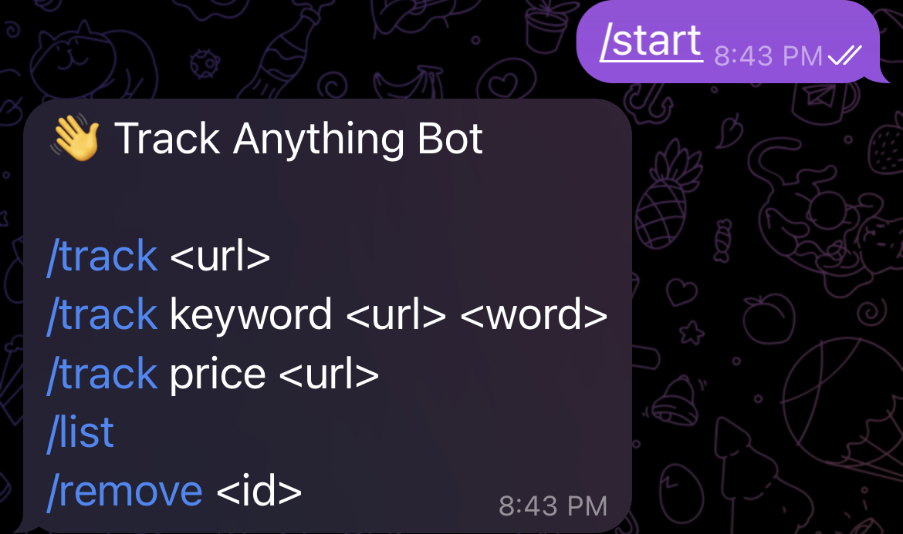

# 🤖 Track Anything – Telegram Bot

A production‑ready Telegram bot that lets users **track any website** for:

* 📄 Page changes
* 🔑 Keyword appearance / disappearance
* 💰 Price changes

The bot uses **Telegram polling (no webhook)** and a lightweight file‑based store.

---

## ✨ Features

* `/track <url>` – Track entire page changes
* `/track keyword <url> <keyword>` – Track keyword changes
* `/track price <url>` – Track price changes
* `/list` – View all active trackers
* `/remove <id>` – Remove a tracker
* Background cron job checks pages periodically
* Auto‑heals corrupted storage file

---

## 🖼️ Screenshots (Add These)

> Add screenshots after you run the bot

1. **Bot start screen**

   * Screenshot of `/start` output

2. **Tracking a website**

   * `/track https://example.com`

3. **Listing trackers**

   * `/list`

4. **Alert notification**

   * Message sent when a change is detected

📸 Save screenshots in a `screenshots/` folder and reference them like:

```md

```

---

## 🧱 Project Structure

```
track-anything-bot/
│
├── src/
│   ├── index.js        # App entry (polling + cron)
│   ├── bot.js          # Telegram bot init
│   ├── commands.js     # Command handlers
│   ├── checker.js      # Change detection logic
│   ├── tracker.js      # Tracker CRUD
│   ├── store.js        # File-based storage (safe)
│   ├── utils.js        # Helpers (hash, price extract)
│   └── config.js       # Env config
│
├── data/
│   └── trackers.json   # Persistent storage
│
├── .env
├── package.json
└── README.md
```

---

## 🚀 Step-by-Step Setup

### 1️⃣ Create Telegram Bot

1. Open Telegram
2. Search for **@BotFather**
3. Run:

   ```
   /start
   /newbot
   ```
4. Copy the **BOT TOKEN**

---

### 2️⃣ Clone & Install

```bash
git clone https://github.com/vikrantshroti/track-anything-bot
cd track-anything-bot
npm install
```

---

### 3️⃣ Environment Setup

Create `.env` file:

```env
BOT_TOKEN=YOUR_TELEGRAM_BOT_TOKEN
```

⚠️ No quotes, no spaces

---

### 4️⃣ Prepare Storage

Create file:

```
data/trackers.json
```

With content:

```json
[]
```

---

### 5️⃣ IMPORTANT – Disable Webhook

If you ever used webhook before, **run this once**:

```bash
curl https://api.telegram.org/bot<YOUR_TOKEN>/deleteWebhook
```

Polling will NOT work unless webhook is deleted.

---

### 6️⃣ Start the Bot

```bash
npm start
```

Expected log:

```
🤖 Track Anything Bot started (polling)
```

---

## 🧪 Usage Examples

### Start Bot

```
/start
```

### Track a Page

```
/track https://example.com
```

### Track Keyword

```
/track keyword https://example.com sale
```

### Track Price

```
/track price https://example.com
```

### List Trackers

```
/list
```

### Remove Tracker

```
/remove 2
```

---

## ⚠️ Known Limitations

* Amazon / Flipkart may block requests
* Cloudflare-protected sites may fail
* Price extraction is heuristic-based

Best for:

* Blogs
* News sites
* Docs
* Landing pages

---

## 🛠️ Tech Stack

* Node.js
* node-telegram-bot-api
* Axios
* node-cron
* File-based JSON storage

---

## 🔮 Future Improvements

* PostgreSQL / SQLite
* Proxy support
* Headless scraping (Playwright)
* Telegram payments
* SaaS dashboard

---

## 📜 License

MIT License

---

## 🙌 Author

Built by **Vikrant Shroti**

If this helped you, ⭐ the repo!
